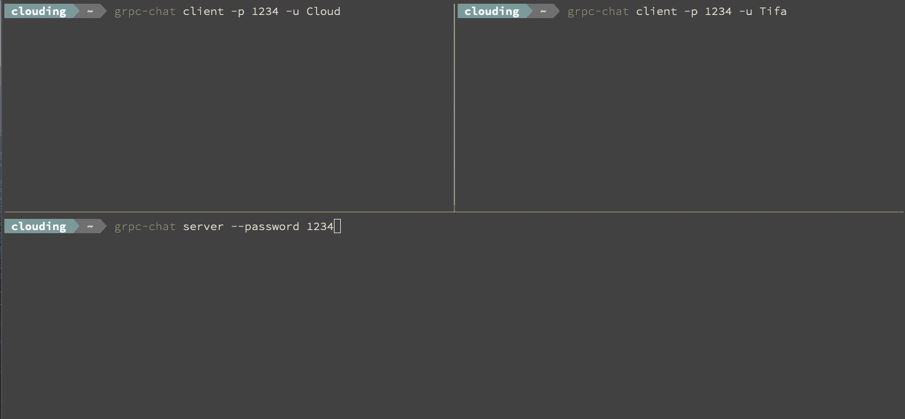

# gRPC Chat

A simple Chat implemented with [Go](https://golang.org/), [gRPC](https://grpc.io/)



## Installation

```
git clone git@github.com:cloudingcity/grpc-chat.git
cd grpc-chat
go install
```

## Command Usage

```
Simple Chat implemented with gRPC

Usage:
  grpc-chat [command]

Available Commands:
  client      Run as client
  server      Run as server

Flags:
  -h, --help   help for grpc-chat

Use "grpc-chat [command] --help" for more information about a command.
```

### Run as server

```shell script
grpc-chat server --port 8888 --password 123456
```

### Run as client

```shell script
grpc-chat client --addr :8888 --password 123456 --username Cloud
```
